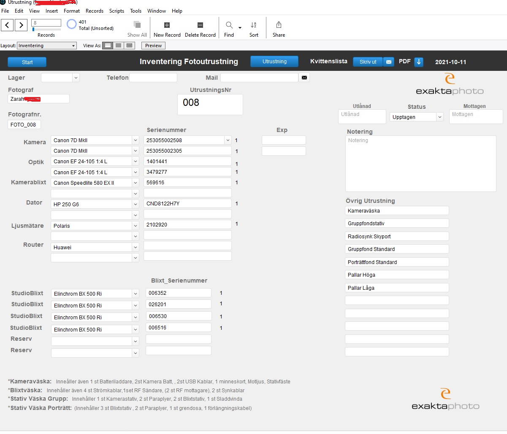
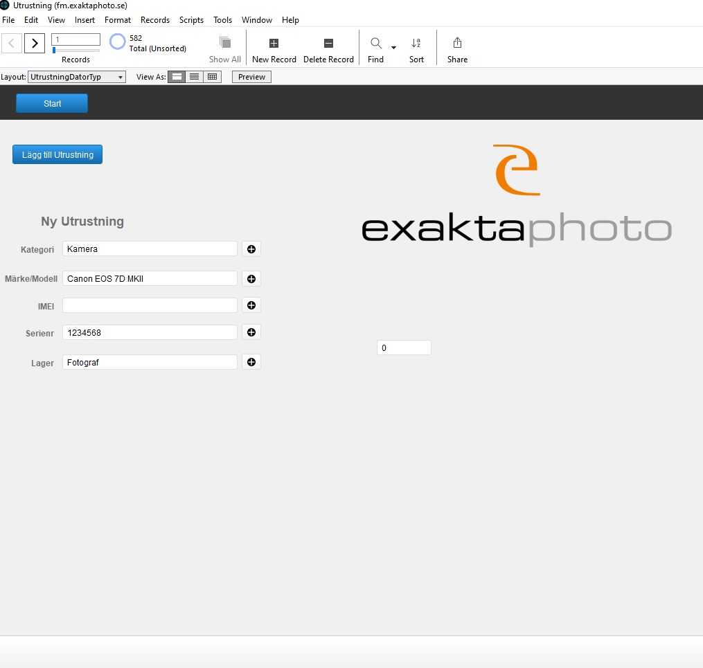
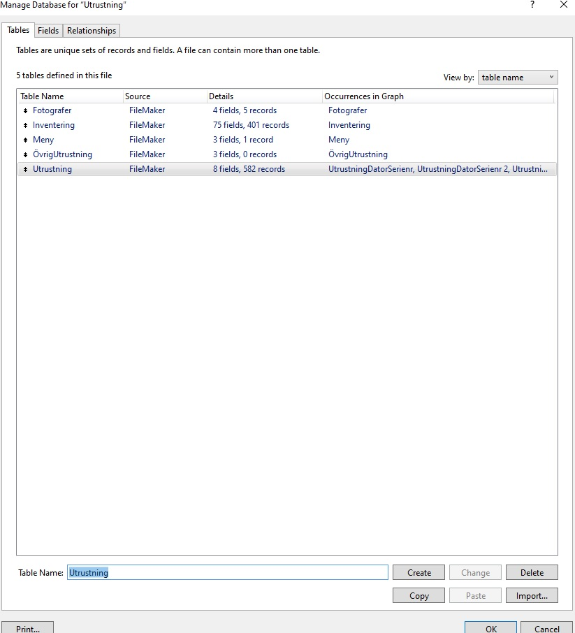
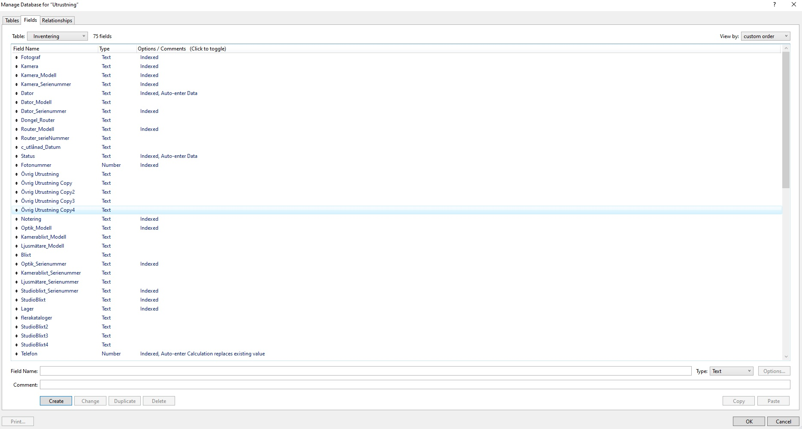
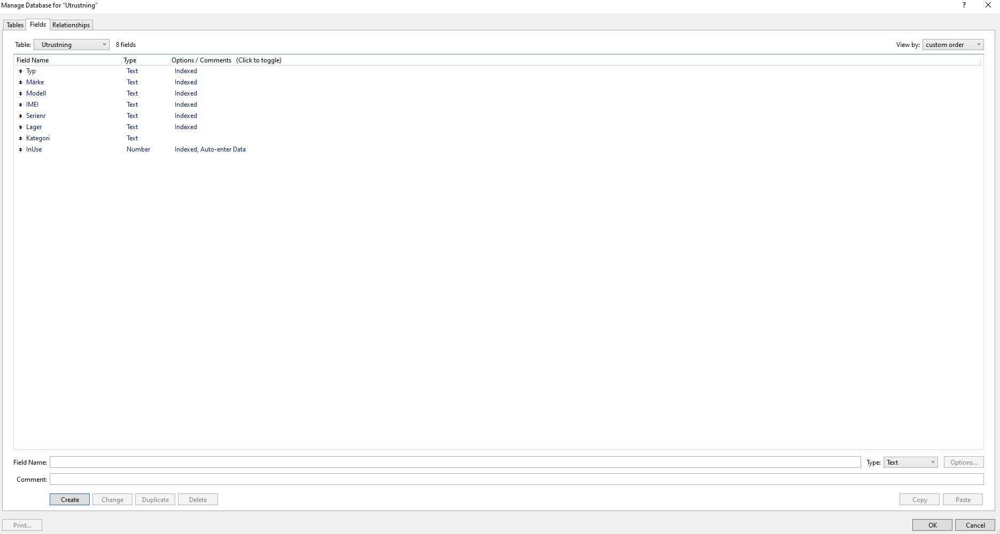
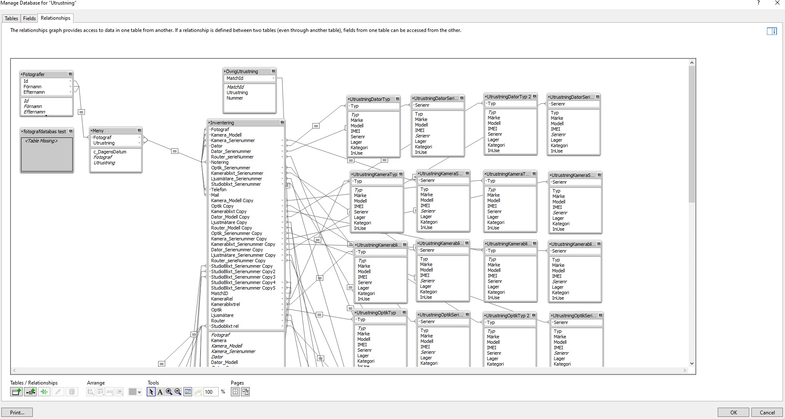
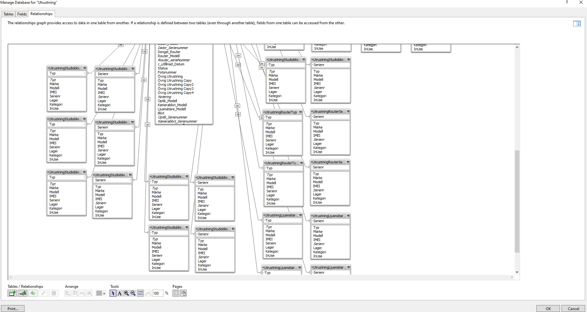

# Inventory-Filemaker-Project

This was a project I had been ordered to do, basically the company had an outdated Inventory that wasn't very optimal. I was tasked to build a new better Inventory system that is a little easier to use, more detailed, with a better overall view etc. This project was created with Claris Filemaker 19. Due to security & GDPR reasons I wasn't able to upload the database file for this project, therefor I have attached the following images to show an overall view of the system.

First look at the overiew of the Inventory for each user

